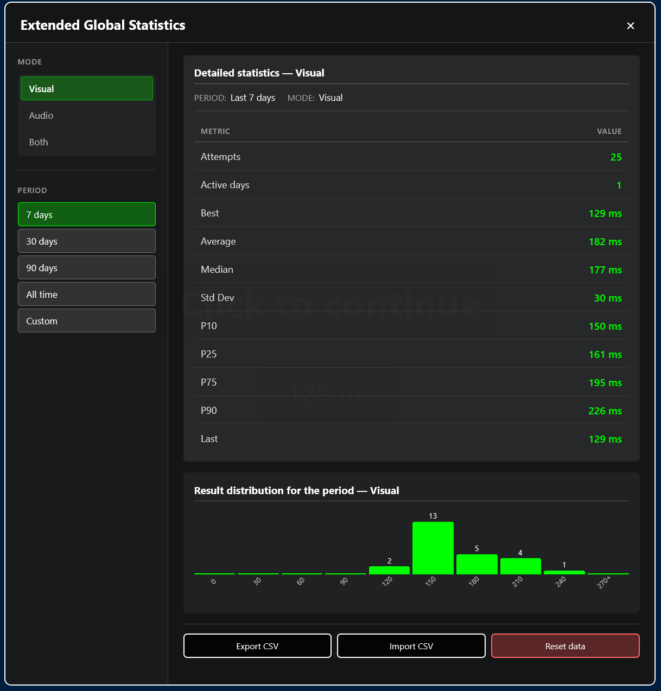

# AiReaction Test

A modern, feature-rich reaction time testing tool built as a single HTML file. Test your visual and audio reaction speeds with customizable settings, track your progress over time, and compete with daily challenges.

## Features

### 🎯 Core Functionality
- **Visual Mode**: React to color changes on the screen
- **Audio Mode**: React to sound signals (with eyes closed)
- **Customizable Delay**: Set minimum and maximum signal delay (500ms–20000ms)
- **Reaction Boundaries**: Define what counts as a valid reaction (75–300ms by default)
- **Outlier Detection**: Automatically identifies too-fast or too-slow reactions

### 📊 Session Statistics
Track your performance in real-time:
- Number of attempts
- Best result
- Average reaction time
- Median reaction time
- Standard deviation
- Last result with trend indicator
- Live histogram distribution

### 🔥 Daily Challenge
Compete with yourself every day:
- Complete 5 attempts per day
- Track your daily streak
- View your personal best for the day
- See progress bar for daily completion
- Browse history of past daily challenges
- Compare last 7 days performance at a glance

### 🌈 Color Themes
Choose from multiple interface palettes:
- Classic (default blue/red/green)
- Monochrome (Black & White)
- Ocean
- Sunset
- Neon
- Toxic Green
- Custom theme editor

### 📈 Global Statistics
Advanced analytics across all sessions:
- Active days counter
- Overall average reaction time
- Total attempts count
- Standard deviation
- Filterable by mode (Visual/Audio/Both)
- Time period selection (7/30/90 days, all time, custom range)
- Detailed period statistics with histograms
- CSV export/import functionality

### ⚙️ Customizable Settings
Fine-tune your testing experience:
- **Signal Delay**: Min/max waiting time before the signal
- **Reaction Boundaries**: Define valid reaction time range
- **Histogram Range**: Set min/max values and number of bins for session histogram

## Usage

### Quick Start
1. Open `reaction_test.html` in any modern web browser
2. Click anywhere on the screen to start
3. Wait for the green signal (or sound in audio mode)
4. Click as fast as you can!
5. View your results and continue testing

### Keyboard Shortcuts
- **Esc**: Stop current attempt
- **Click**: Interact with the test area

### Modes Explained

#### Visual Mode
The screen changes from red (waiting) to green (ready). Click when you see green!

#### Audio Mode
Listen for an audio beep. Perfect for testing pure reaction time without visual cues.

## Installation

No installation required! This is a standalone HTML file that runs entirely in your browser.

1. Download or clone this repository
2. Open `reaction_test.html` in Chrome, Firefox, Safari, or Edge
3. That's it!

## Technical Details

- **Single File**: Everything (HTML, CSS, JavaScript) is contained in one file
- **No Dependencies**: Works offline without any external libraries
- **Local Storage**: All your data is saved locally in browser storage
- **Responsive Design**: Adapts to different screen sizes
- **Privacy First**: No data leaves your device

## Data Management

### Export Data
You can export your global statistics to CSV format for backup or analysis.

### Import Data
Restore your progress from a previously exported CSV file.

### Reset Options
- **Reset Session**: Clear current session statistics (histogram data preserved)
- **Reset Global Data**: Delete all saved results and history (use with caution!)

## Screenshots

> Add your screenshots in the `screenshots/` directory:

| Screenshot | Description |
|------------|-------------|
| `main-interface.png` | Main test interface showing the reaction area |
| `session-stats.png` | Session statistics panel with histogram |
| `daily-challenge.png` | Daily challenge panel with streak tracker |
| `color-themes.png` | Theme selector showing different color palettes |
| `global-stats.png` | Extended global statistics modal |
| `settings-panel.png` | Settings configuration panel |

## Browser Compatibility

Works on all modern browsers:
- ✅ Google Chrome
- ✅ Mozilla Firefox
- ✅ Microsoft Edge
- ✅ Safari
- ✅ Opera

## Tips for Better Results

1. **Rest your eyes** before testing in visual mode
2. **Use audio mode** for testing pure reflexes
3. **Complete daily challenges** consistently to track long-term improvement
4. **Adjust boundaries** if you get many outlier results
5. **Compare modes** to see if you're faster with visual or audio cues

## License

This project is provided as-is for educational and personal use.

---

**Built with ❤️ as a vibe-coded HTML super-file**
