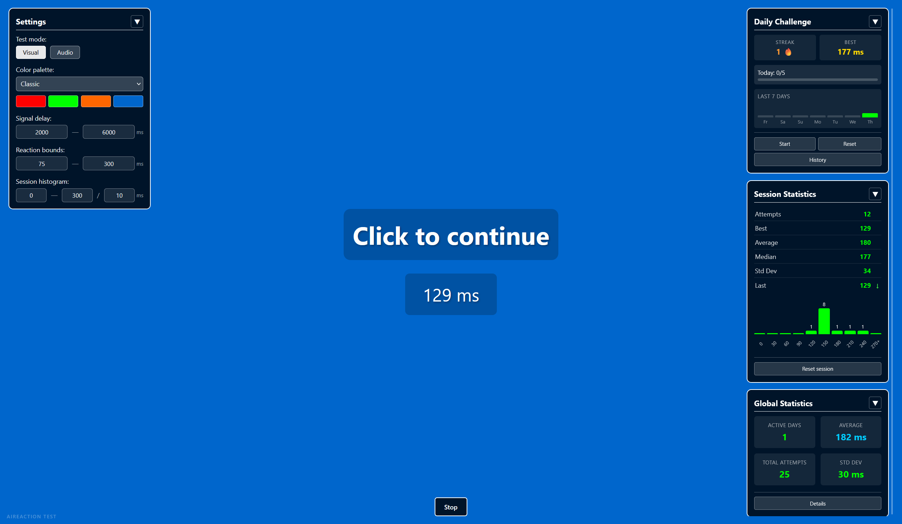

<h1 align="center">⚡ AiReaction Test</h1>

<p align="center">
  <strong>A blazing-fast, zero-dependency reaction time laboratory contained entirely within a single HTML file.</strong><br>
  Test your visual and audio reflexes, build daily streaks, and analyze your performance over time.
</p>

<p align="center">
  
  
  
  
  
  
</p>

<p align="center">
  
</p>

---

## ✨ Key Features

### 🎯 Core Testing Engine
- **Dual Modes**: Test **Visual** reflexes (color changes) or pure **Audio** reflexes (synthesized beeps via Web Audio API).
- **Smart Outlier Detection**: Automatically flags anticipatory clicks (too fast) or distracted delays (too slow) based on customizable boundaries.
- **Dynamic Delays**: Randomized signal delays (500ms–20,000ms) to prevent rhythm-guessing.

### 📊 Deep Analytics
- **Real-Time Session Stats**: Track attempts, best/average/median times, standard deviation, and trend indicators.
- **Live Histograms**: Visualize your reaction distribution on the fly with customizable bins and ranges.
- **Global Statistics Dashboard**: Filter historical data by mode (Visual/Audio/Combined) and timeframes (7, 30, 90 days, All-Time, or Custom ranges).

### 🔥 Daily Challenges
- **The 5-Attempt Gauntlet**: Complete 5 valid attempts to lock in your daily score.
- **Streak Tracking**: Build and maintain daily consistency streaks (🔥).
- **Historical Leaderboard**: Browse your past daily averages and highlight your all-time personal bests.

### 🎨 Customization & Themes
- **6 Built-in Palettes**: Classic, Monochrome, Ocean, Sunset, Neon, and Toxic Green.
- **Custom Theme Editor**: Fine-tune the exact hex codes for waiting, ready, outlier, and idle states.
- **Collapsible UI**: Hide settings and stats panels to maximize your focus area.

### 💾 Data Management
- **CSV Export/Import**: Back up your global history or transfer your data between devices.
- **Granular Resets**: Clear just your current session, or nuke your entire global history (while preserving your UI settings).

---

## 🚀 Quick Start

Because it's a single file, there is **no build step, no npm install, and no server required**.

1. Download `index.html` (or clone this repository).
2. Double-click the file to open it in any modern web browser (Chrome, Firefox, Safari, Edge).
3. Click the main screen (or press `Space`) to begin.
4. Wait for the signal and react as fast as you can!

---

## ⌨️ Controls & Shortcuts

| Action | Control | Description |
| :--- | :--- | :--- |
| **Start / Click** | `Left Click` or `Spacebar` | Interact with the test area or advance to the next attempt. |
| **Cancel Attempt** | `Esc` | Abort the current waiting phase and return to the idle state. |

---

## 🛠️ Technical Highlights

- **📄 Single-File Architecture**: HTML, CSS, and JS are seamlessly integrated into one portable file. Perfect for USB drives, offline use, or quick sharing.
- **🔒 Privacy First**: 100% of your data is stored in your browser's `LocalStorage`. Absolutely no telemetry, tracking, or external network requests.
- **🎵 Web Audio API**: Audio mode doesn't rely on external `.mp3` or `.wav` files. Beeps are synthesized mathematically in real-time for zero-latency playback.
- **📱 Responsive Design**: Fully adapts to mobile, tablet, and ultrawide desktop monitors.

---

## 💡 Pro-Tips for Better Results

1. **Eliminate Visual Bias**: Use **Audio Mode** with your eyes closed to test pure neurological reflexes without the processing time of visual cortex interpretation.
2. **Mind the Boundaries**: If you frequently get "Outlier" warnings, adjust the *Reaction Boundaries* in the settings panel to match your natural baseline.
3. **Hardware Matters**: For the most accurate results, use a wired mouse and a high-refresh-rate monitor. Bluetooth mice and trackpads can introduce 10-30ms of input lag.
4. **Warm Up**: Your first few attempts will likely be outliers. Do a casual session before starting your "Daily Challenge".

---

## 📂 File Structure

```text
📁 AiReaction-Test
 ┣ 📄 README.md            # This file
 ┣ 📄 reaction_test.html   # The entire application
 ┗ 📁 screenshots/         # Images for this README
    ┣ 🖼️ main-interface.png
    ┗ 🖼️ global-stats.png
