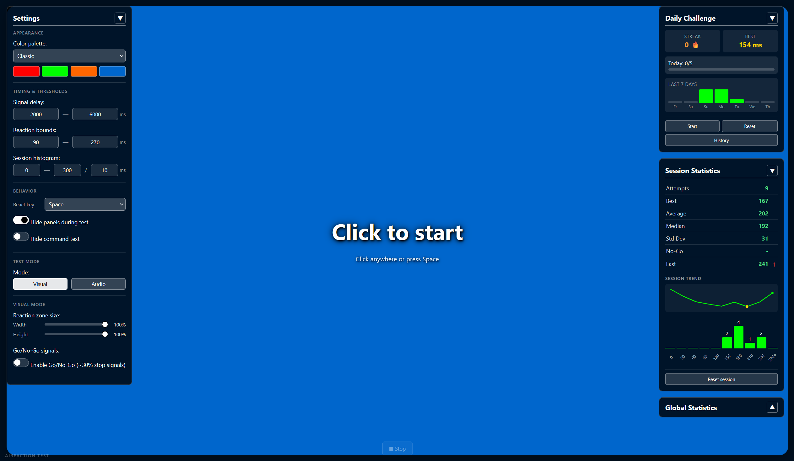

<p align="center">
  <a href="https://nocleum.github.io/AiReaction-Test/">
    
  </a>
</p>

<p align="center">
  
  
  
  
  
  
</p>

<p align="center">
  <a href="#-quick-start"></a>
  <a href="#-features"></a>
  <a href="#-use-cases"></a>
  <a href="#-faq"></a>
</p>

<br>

> *"How fast is your brain, really?"*
> A lightweight, privacy-first laboratory for measuring visual and auditory reflexes — no installs, no accounts, no cloud. Just one file and your nervous system.

<p align="center">
  <a href="https://nocleum.github.io/AiReaction-Test/">
    
  </a>
</p>

<p align="center">
  <a href="https://nocleum.github.io/AiReaction-Test/"></a>
</p>

<p align="center">
  
</p>

---

## ✨ Features

<table>
  <tr>
    <td align="center" width="50%">
      <h3>🎯 Dual-Mode Testing</h3>
      <p>Visual reflexes (color transitions) <em>or</em> pure auditory reflexes via Web Audio API synthesis.</p>
    </td>
    <td align="center" width="50%">
      <h3>🧠 Go / No-Go Training</h3>
      <p>Optional decoy signals (~30%) train inhibitory control — a staple of cognitive psychology labs.</p>
    </td>
  </tr>
  <tr>
    <td align="center" width="50%">
      <h3>📊 Deep Analytics</h3>
      <p>Live sparklines, histograms, percentiles (P10–P90), standard deviation, and trend deltas per attempt.</p>
    </td>
    <td align="center" width="50%">
      <h3>🔥 Daily Challenges</h3>
      <p>A 5-attempt gauntlet with streaks, 7-day bars, and a personal-best leaderboard.</p>
    </td>
  </tr>
  <tr>
    <td align="center" width="50%">
      <h3>🎨 Themeable</h3>
      <p>Six built-in palettes plus a full color-picker editor. The UI derives its background from the idle color automatically.</p>
    </td>
    <td align="center" width="50%">
      <h3>📱 Responsive</h3>
      <p>Adapts from ultrawide monitors down to phones — reaction zone docks on top, panels flow below.</p>
    </td>
  </tr>
</table>

<p align="center">
  
</p>

## 🚀 Quick Start

Because this is a single file, there is **no build step, no `npm install`, and no server required**.

<div align="center">

| Step | Action |
| :---: | :--- |
| **1** | 📥 Download `index.html` or clone the repository |
| **2** | 🖱️ Double-click the file to open it in any modern browser |
| **3** | 👆 Click anywhere on the screen — or press `Space` — to begin |
| **4** | ⏱️ Wait for the signal, then react as fast as you can |

</div>

<p align="center">
  
</p>

## 🛠️ Tech Stack

<p align="center">
  
  
  
  
  
</p>

- **Single-file architecture** — HTML, CSS, and JS live together in one portable document.
- **100% local storage** — nothing leaves your browser. No analytics, no beacons, no telemetry.
- **Zero-latency audio** — beeps are synthesized mathematically; no `.mp3` or `.wav` files.
- **State-aware theming** — watermark, text, and page background are computed from the active palette.

<p align="center">
  
</p>

## 🎯 Use Cases

| Audience | Why it's useful |
| :--- | :--- |
| **Esports athletes** | Quantify raw input speed, track drift across sessions, train false-start suppression with Go/No-Go. |
| **Researchers & students** | A ready-made reaction-time tool for cognitive psychology assignments — no lab setup required. |
| **Coaches & trainers** | Measure warm-up curves, fatigue, and caffeine effects with percentiles and sparklines. |
| **Curious minds** | Settle the classic *"are mornings really faster?"* question with your own data. |
| **Developers** | A reference implementation of a polished, single-file vanilla-JS application. |

<p align="center">
  
</p>

## ⌨️ Controls

<table>
  <thead>
    <tr>
      <th>Action</th>
      <th>Input</th>
      <th>Notes</th>
    </tr>
  </thead>
  <tbody>
    <tr>
      <td><strong>Start / React</strong></td>
      <td><code>Left Click</code> · <code>Space</code> · <code>Enter</code> · <code>F</code></td>
      <td>Configurable in Settings → Behavior.</td>
    </tr>
    <tr>
      <td><strong>Cancel attempt</strong></td>
      <td><code>Esc</code></td>
      <td>Aborts the current waiting phase.</td>
    </tr>
    <tr>
      <td><strong>Close modal</strong></td>
      <td><code>Esc</code> · click backdrop</td>
      <td>Works on every dialog.</td>
    </tr>
  </tbody>
</table>

<p align="center">
  
</p>

## 💡 Pro Tips

1. **Eliminate visual bias.** Run **Audio Mode** with your eyes closed to measure pure auditory reflexes, skipping visual-cortex processing time.
2. **Respect the boundaries.** If you see frequent "Outlier" flags, widen the *Reaction Boundaries* in Settings to match your natural baseline.
3. **Hardware matters.** A wired mouse + a high-refresh-rate monitor is the gold standard. Bluetooth devices and trackpads routinely add 10–30 ms.
4. **Warm up properly.** The first 3–5 attempts of any session tend to be outliers — burn them in a casual run before your Daily Challenge.
5. **Train inhibition.** Go/No-Go mode isn't just a gimmick; it trains the stop-signal circuitry that underpins real-world reaction tasks.

<p align="center">
  
</p>

## ❓ FAQ

<details>
  <summary><strong>Where is my data stored?</strong></summary>
  <br>
  Everything lives in your browser's <code>localStorage</code> under keys prefixed with <code>reaction*</code>. Nothing is ever sent to a server.
</details>

<details>
  <summary><strong>Can I transfer my data to another device?</strong></summary>
  <br>
  Yes. Use <strong>Backup JSON</strong> in the Global Statistics modal, transfer the file, then <strong>Restore JSON</strong> on the new machine.
</details>

<details>
  <summary><strong>Why does the audio beep feel slightly late?</strong></summary>
  <br>
  Browsers gate audio behind a user gesture for privacy. The very first beep warms up the AudioContext; subsequent ones are effectively zero-latency.
</details>

<details>
  <summary><strong>Does this work on mobile?</strong></summary>
  <br>
  Yes. The layout restructures into a vertical flow, the reaction zone docks at the top, and the Stop button sticks to the bottom.
</details>

<details>
  <summary><strong>Can I embed it on my own site?</strong></summary>
  <br>
  Absolutely — drop the single <code>index.html</code> into any static host (GitHub Pages, Netlify, Cloudflare Pages, your own server). No build step.
</details>

<p align="center">
  
</p>

## 📂 File Structure

```text
AiReaction-Test
├── README.md            # This document
├── index.html           # The entire application
└── screenshots/         # Images used in this README
    ├── main-interface_vX.png
    └── global-stats.png
```

<p align="center">
  
</p>

📜 License
Released under the MIT License — use it, fork it, embed it, sell it. No strings attached.
<p align="center">
  <a href="https://github.com/nocleum/AiReaction-Test/stargazers"></a>
  <a href="https://github.com/nocleum/AiReaction-Test/issues"></a>
  <a href="https://github.com/nocleum/AiReaction-Test"></a>
</p>

<p align="center">
  <sub>Made with no brain, no skill, and only AI.</sub>
</p>
